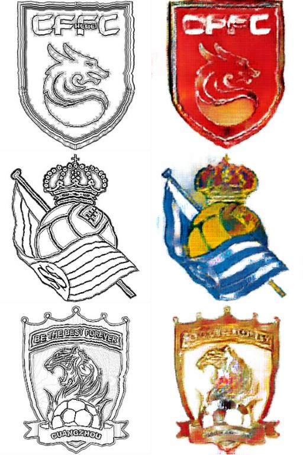
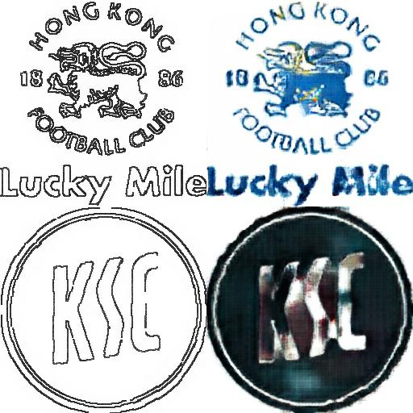
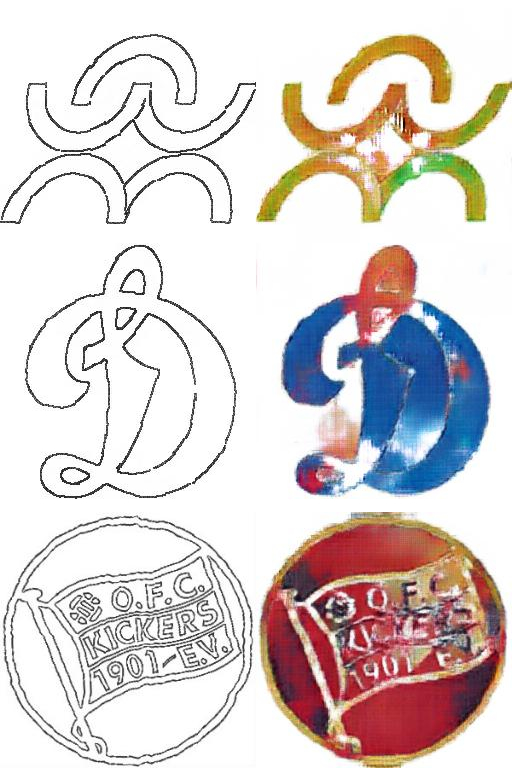
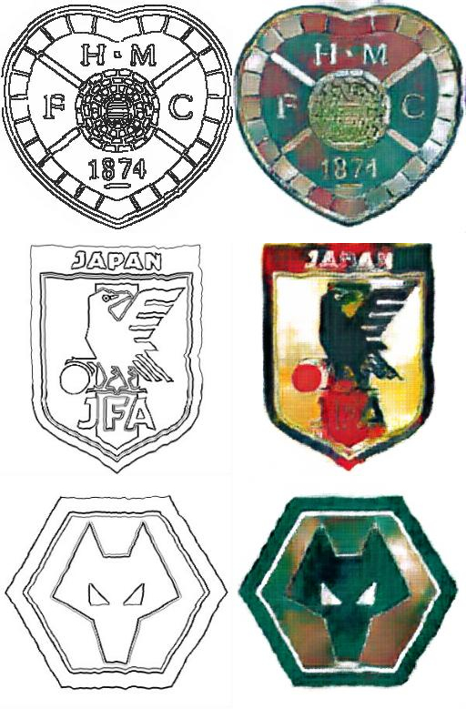
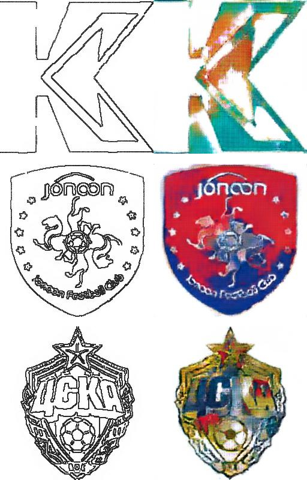
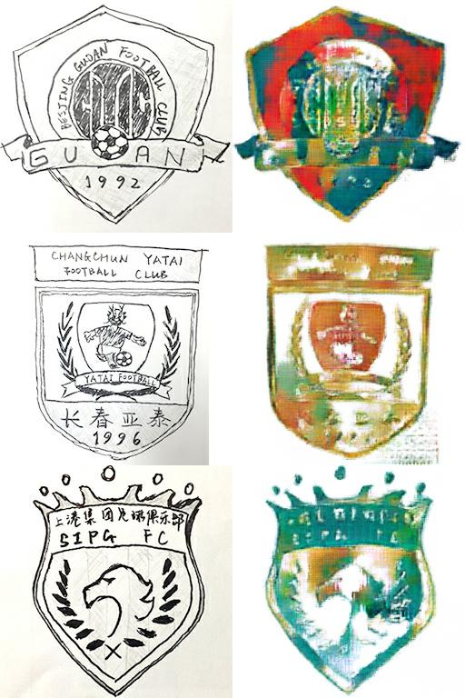

# logo2logo
A pix2pix project converting sketch sports logos to authentic ones, using TensorFlow Estimators.
## About Pix2Pix
+ Pix2Pix is a typical conditional GAN.
+ Its generator is a U-Net.
+ Its discriminator is a Patch-GAN.
+ The batch normalization won't be needing run_mean & run_std, because test mode in Pix2Pix is actually ran in the same fashion as train mode. As we don't want the training data interfering with the test data.
## About logo2logo
+ This project tries to restore a logo of a football club from a sketch. Or more precisely, paint the sketch.
+ As you may presume, the network may struggle, as there could be tons of color combinations for a simple shape, say circle, triangle, etc. But I want to do it anyway.
## Dataset preperation
+ I used Photoshop to estimate some sketches at first. But that is too much effort and time consuming. So I switched to Python and OpenCV to mimic a hand-drawn effect.
+ To collect enough data for the training set, I spidered logos from Kotologo: https://kotologo.com, an up-to-date football logo collection.
## During training
+ The first thing the network learned to do, is to identify where the background is and make it white.
+ The network really struggles as first how to paint in terms of color selection.
+ Later it would learn some small features from the training set, and paint more naturally, e.g. red and yellow for crowns.
+ The network performs a lot better in single-colored logos than in multi-color logos.
+ I think after epochs of training, the network on the one hand overfits, on the other hand will choose the color for a certain shape, say circle base on the statistical property of the training set. (Of course the real feature the network learns will be way more delicate and specific.)
## Testing
+ I used some left-over logos from spider and my photoshoped logos from first try-out as test set.
+ I also included some real hand-drawn logos by my friend Tong.
+ I found that for logos that appeared in the trianing set (of course the sketch is still different, these would be my photoshoped logos), the network overfitted so that they would appear to be good.
+ But for new logos, the network still struggles, especially for multi-colored logos.
+ Surprisingly the network learned how to identify a single-colored logo, and paint it accordingly. Maybe they generally contains simple layout.
+ For hand-drawn logos, the output really depends on how well the logo is drawn and whether or not it appeared in the training set.
## Sample results
+ For data similar to the network has trained, the performance is generally good.

+ For one-colored logos, even if the network hasn't seen it before, the performance is okay.

+ But some simple-shaped logos may be misclassified as one-colored logos, and some may confuse the network on where to paint the color.

+ For other logos, some of them get fairly good results.

+ While others really struggle.

+ As for genuine hand-drawn logos, some minor features may be detected and correctly painted, however the overall result is not very pleasing.

